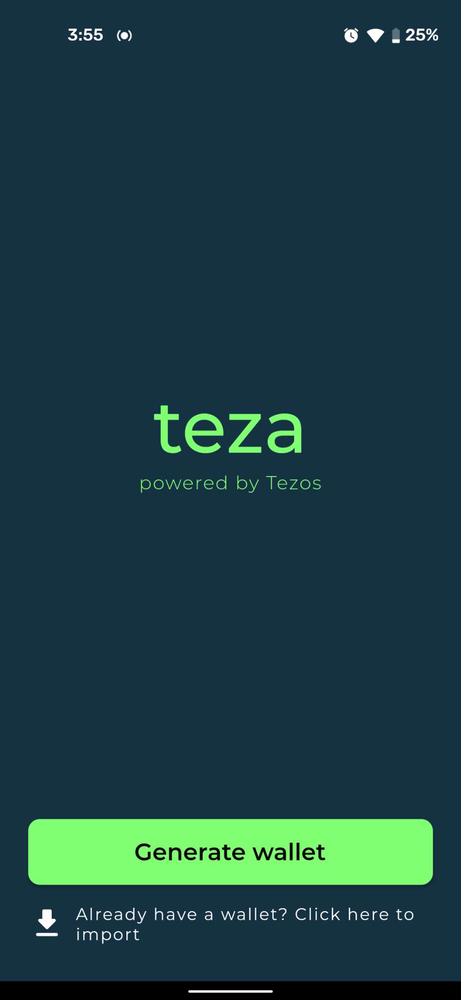
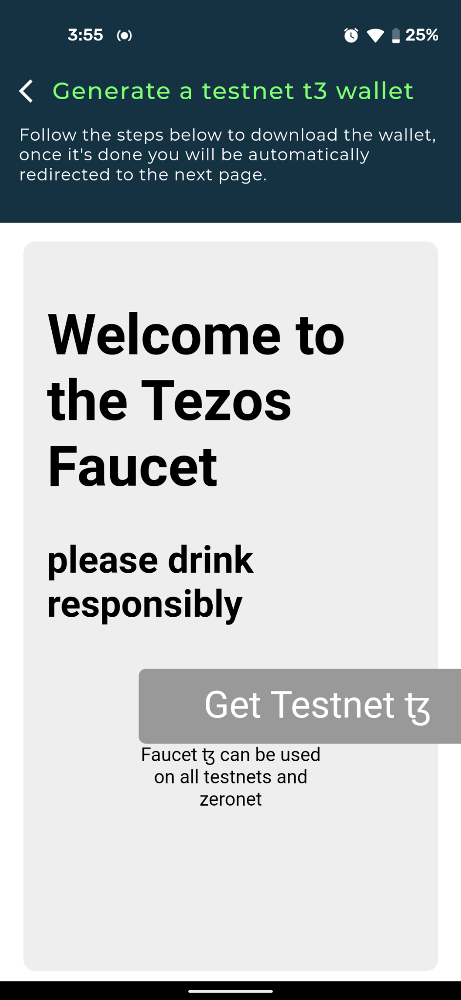
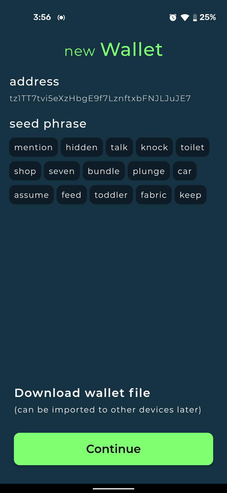
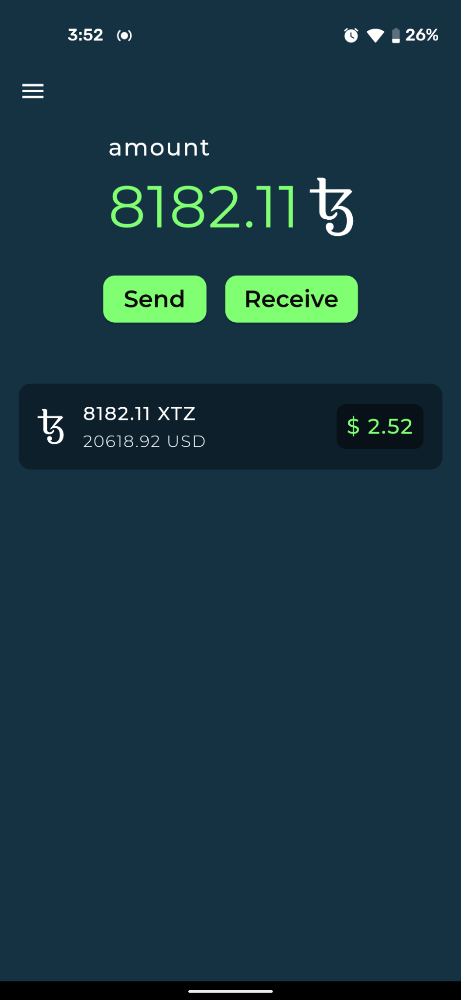
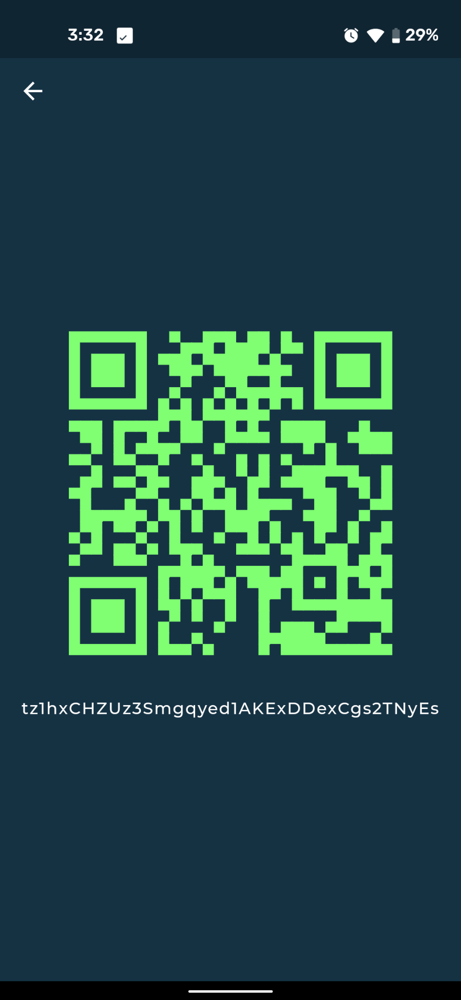
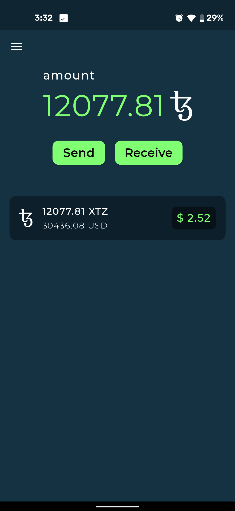

# teza - powered by Tezos

A minimalistic Tezos wallet that helps in storing and sending/receiving funds with ease. It is secure as it is build totally on the Tezos platform. I have used Hive for the on-device storage as it is fast and helps in storing the data securely. Apart from this, it has a very minimalist UI.

* [Presentation (PPT link)](https://docs.google.com/presentation/d/1A4P4dxH6GhLOAo_mi8qkC2shcA-qSGI618iUZ7HcaoE/edit)
* [Video link](https://youtu.be/Gm5wR50yf6s)

## Screenshots

  
  
  

  
  
  

## Tech stack

* Flutter
* Tezos (`tezster_dart`)
* Hive (local database)

## Plugins

The following Flutter plugins are used to build the app:

* [tezster_dart](https://pub.dev/packages/tezster_dart)
* [flutter_inappwebview](https://pub.dev/packages/flutter_inappwebview)
* [permission_handler](https://pub.dev/packages/permission_handler)
* [flutter_downloader](https://pub.dev/packages/flutter_downloader)
* [path_provider](https://pub.dev/packages/path_provider)
* [shared_preferences](https://pub.dev/packages/shared_preferences)
* [hive](https://pub.dev/packages/hive)
* [hive_flutter](https://pub.dev/packages/hive_flutter)
* [qr_flutter](https://pub.dev/packages/qr_flutter)

## License

Copyright (c) 2021 Souvik Biswas

Permission is hereby granted, free of charge, to any person obtaining a copy
of this software and associated documentation files (the "Software"), to deal
in the Software without restriction, including without limitation the rights
to use, copy, modify, merge, publish, distribute, sublicense, and/or sell
copies of the Software, and to permit persons to whom the Software is
furnished to do so, subject to the following conditions:

The above copyright notice and this permission notice shall be included in all
copies or substantial portions of the Software.

THE SOFTWARE IS PROVIDED "AS IS", WITHOUT WARRANTY OF ANY KIND, EXPRESS OR
IMPLIED, INCLUDING BUT NOT LIMITED TO THE WARRANTIES OF MERCHANTABILITY,
FITNESS FOR A PARTICULAR PURPOSE AND NONINFRINGEMENT. IN NO EVENT SHALL THE
AUTHORS OR COPYRIGHT HOLDERS BE LIABLE FOR ANY CLAIM, DAMAGES OR OTHER
LIABILITY, WHETHER IN AN ACTION OF CONTRACT, TORT OR OTHERWISE, ARISING FROM,
OUT OF OR IN CONNECTION WITH THE SOFTWARE OR THE USE OR OTHER DEALINGS IN THE
SOFTWARE.
